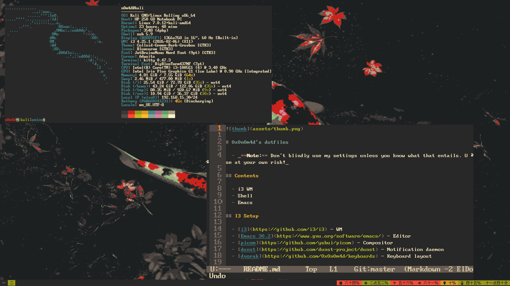

# 0x0n0m4d's dotfiles

  - _**Note:** Don’t blindly use my settings unless you know what that entails. Use at your own risk!_

## Contents

  - i3 WM
  - Shell

## I3 Setup

  - [i3](https://github.com/i3/i3) - WM
  - [Quickshell](https://quickshell.org/) - Status Bar
  - [picom](https://github.com/yshui/picom) - Compositor
  - [dunst](https://github.com/dunst-project/dunst) - Notification daemon
  - [dvorak](https://github.com/0x0n0m4d/keyboards) - Keyboard layout

## Shell setup (Linux)

  - [Kitty](https://sw.kovidgoyal.net/kitty/) - Terminal
  - [zsh](https://www.zsh.org/) - Shell
    - [zsh vi mode](https://github.com/jeffreytse/zsh-vi-mode) - Shell
  - [nerd fonts](https://www.nerdfonts.com/) JetBrainsMono Font
  - [neovim](https://github.com/neovim/neovim) - Editor
    - [lazyVim](https://www.lazyvim.org/)
  - [mitmproxy](https://www.mitmproxy.org/)
  - [sc-im](https://github.com/andmarti1424/sc-im)
  - [pomo](https://github.com/Bahaaio/pomo)
  - [calcurse](https://github.com/lfos/calcurse)
