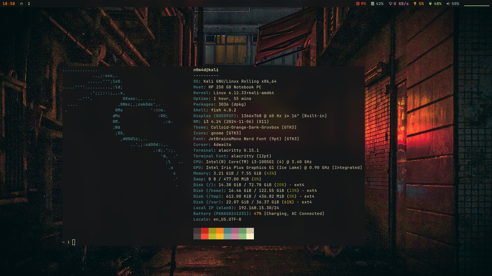

# 0x0n0m4d's dotfiles

  - _**Note:** Don’t blindly use my settings unless you know what that entails. Use at your own risk!_

## Contents

  - i3 WM
  - Shell

## I3 Setup

  - [i3](https://github.com/i3/i3) - WM
  - [i3Blocks](https://github.com/vivien/i3blocks) - Status Bar
  - [picom](https://github.com/yshui/picom) - Compositor
  - [dunst](https://github.com/dunst-project/dunst) - Notification daemon
  - [dvorak](https://github.com/ThePrimeagen/keyboards) - Keyboard layout

## Shell setup (Linux)

  - [alacritty](https://alacritty.org/) - Terminal
  - [zsh](https://www.zsh.org/) - Shell
    - [zsh vi mode](https://github.com/jeffreytse/zsh-vi-mode) - Shell
  - [nerd fonts](https://www.nerdfonts.com/) JetBrainsMono Font
  - [neovim](https://github.com/neovim/neovim) - Editor
    - [lazyVim](https://www.lazyvim.org/)
  - [zellij](https://github.com/zellij-org/zellij) - Terminal Multiplexers
    - [ghost plugin](https://github.com/vdbulcke/ghost)
    - [zjstatus plugin](https://github.com/dj95/zjstatus)
